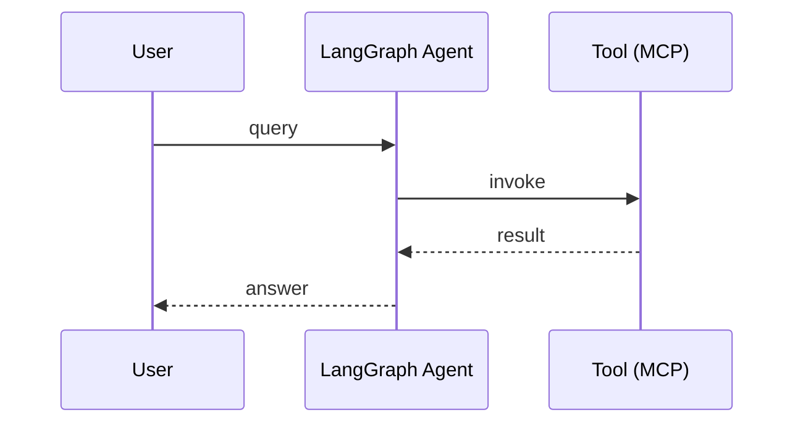

# Diagrams — routing policy

When a draft would benefit from a visual, Quill picks the format that fits the *content*, not a default tool. This file is the routing table.

## Step 0: should this post have a visual at all?

Most posts shouldn't. A visual is justified when **at least one** is true:

- The relationship between components is the point (architecture, sequence)
- The numbers carry the argument (benchmark chart)
- A side-by-side comparison is genuinely faster to grok visually than as text

A visual is **not** justified when:

- The post is a take, story, or lesson with no structural content
- The "diagram" would just be a logo or decorative image
- A 4-row markdown-style table inline would do the same job

When in doubt, skip. A strong text-only post beats a weak post with a diagram.

## Step 1: pick the format

| Visual type | Use this format | Quill produces |
|-------------|----------------|----------------|
| **Architecture / system map** | Manual sketch (Excalidraw) | A *sketch brief* — list of nodes, edges, labels, layout hint. Vivek draws it. |
| **Before/after comparison** | Two manual sketches | Two sketch briefs labeled "before" and "after" |
| **Sequence diagram** | Mermaid `sequenceDiagram` | A mermaid block embedded in the draft `.md` |
| **Decision tree / state machine** | Mermaid `stateDiagram-v2` or `flowchart` | A mermaid block |
| **Timeline / evolution** | Mermaid `gantt` or a horizontal `flowchart` | A mermaid block |
| **Benchmark chart / data plot** | Python (matplotlib or plotly) | A Python snippet Vivek runs; PNG saved to `assets/charts/` |
| **Comparison matrix** | Markdown table in post body | The table goes inline in the post text, no image |
| **Anything else** | Default to "no visual" | Confirm with Vivek before producing |

## Step 2: produce the output

### A. Sketch brief (for manual Excalidraw drawing)

Quill prints this format. Vivek opens excalidraw.com and draws it.

```
## Sketch brief
Title: <one line>
Nodes (left-to-right, top-to-bottom):
  - <node name> — <one-line role>
  - ...
Edges:
  - <node A> → <node B>: <label if any>
  - ...
Annotations:
  - "<key fact or metric>" on <where>
Layout hint: <left-to-right flow | top-to-bottom | grouped clusters>
Stack vocabulary to use: <pull from stack.md — name actual components>
```

Save the eventual PNG export to `assets/diagrams/YYYY-MM-DD-{slug}.png`. Reference it in the draft frontmatter as `diagram:`.

### B. Mermaid block (for sequence / decision / timeline)

Embed directly in the draft `.md` file inside a fenced code block:

```
<!-- mermaid: render this at mermaid.live, screenshot, save to assets/diagrams/ -->

```

Rules for mermaid blocks:
- Use real component names from `stack.md`. No `Service A` or `DB`. Use `pgvector`, `bge-reranker-v2-m3`, `LangGraph orchestrator`.
- Keep it under 12 nodes. If it needs more, the post is doing too much.
- Stick to the diagram type that fits — don't force a flowchart when it should be a sequence diagram.

### C. Python chart (for benchmarks / data)

Quill writes a self-contained Python script. Saves it next to its output:

```
assets/charts/YYYY-MM-DD-{slug}.py     # the script
assets/charts/YYYY-MM-DD-{slug}.png    # produced by running it
```

Script template:
```python
"""
Chart: <title>
Data source: <inline | file | benchmark run>
Run: python assets/charts/YYYY-MM-DD-{slug}.py
"""
import matplotlib.pyplot as plt

# data
labels = ["bge-reranker-v2-m3", "Jina"]
ndcg_at_5 = [0.78, 0.56]

# plot
fig, ax = plt.subplots(figsize=(6, 4))
ax.bar(labels, ndcg_at_5)
ax.set_ylabel("NDCG@5 on internal eval")
ax.set_title("Reranker comparison")

plt.tight_layout()
plt.savefig("assets/charts/YYYY-MM-DD-{slug}.png", dpi=150)
```

Rules for charts:
- Always include a title and axis labels with units
- Default to matplotlib. Use plotly only if Vivek asks for interactivity
- Save at 1200×627 (LinkedIn-friendly) when possible — set figsize and dpi accordingly
- The Python script lives in the repo, not just the PNG, so the chart is reproducible

### D. Markdown table (for comparison matrices)

These go *inside the post body*, not as an image. LinkedIn and X both render plain text well enough:

```
                  Jina    bge-reranker-v2-m3
Accuracy          OK      +40% NDCG@5
Cold start        fast    3x slower
Rate limit        60/min  none
Self-host         no      yes
```

Use indent-aligned columns (not pipe-separated, since those render as literal `|` on the platforms). Keep it under 5 rows × 4 columns or it doesn't fit on mobile.

## Step 3: reference the visual in the draft

In the draft frontmatter:

```
---
date: 2026-05-20
pillar: architecture
...
visual: 
  type: sketch                                 # sketch | mermaid | chart | table | none
  file: assets/diagrams/2026-05-20-rag.png     # path if a file; omit for inline mermaid or inline table
---
```

The `visual:` field is optional. If the post has no visual, omit it entirely.

## Hard rules

- **No visual is better than a generic one.** Skip the diagram before producing slop.
- **Real names from `stack.md` everywhere.** Generic boxes are a smell in every format.
- **The post must stand alone without the visual.** If a reader scrolls past the image, the text still works.
- **One visual max per post.** If a post needs two, it's two posts.
- **Same voice rules apply to embedded text in diagrams** — no em dashes in node labels, no hype.
